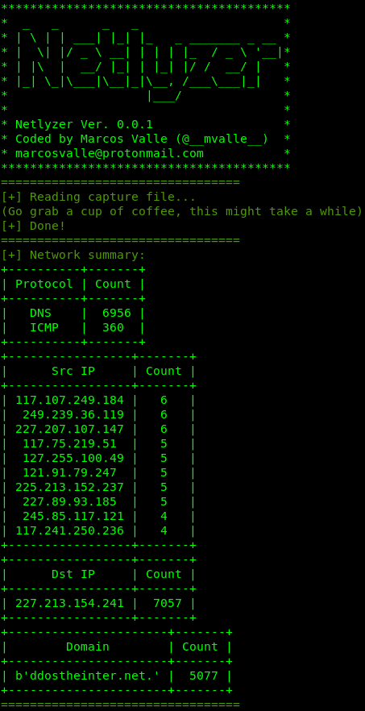
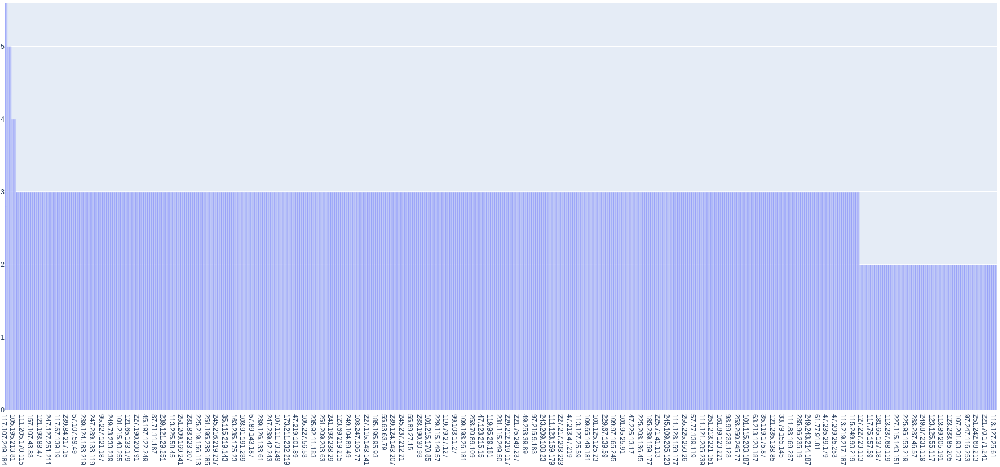
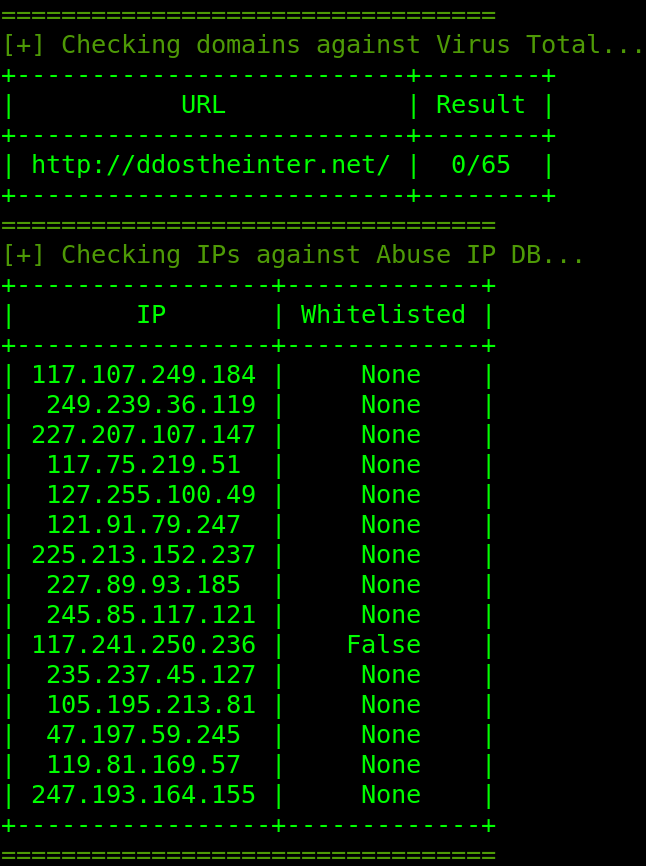

The main goal of this tool is to quickly analyze a pcap file in order to provide short metrics for the network and look for DDoS indicators. Also, it should be extensible as to allow for further development.

# Install
We strongly recommend the usage of pipenv. From the root project folder, run:

```
pipenv install
pipenv shell
python netlyzer/main.py -h
```

Please remember to insert your API keys into the `***REMOVED***` file.

# Usage

* Check IPs and Domains against both VT and AbuseIPDB
  
      python netlyzer/main.py -f ddos.pcap --check vt abuseipdb
  
* Plot fancy graphics:
  
      python netlyzer/main.py -f ddos.pcap --graph
  
* Show verbose reading of packets:

      python netlyzer/main.py -f ddos.pcap -v
  
# How it works?
Netlyzer was developed from scratch using basically Python3.6, scapy and visualizing modules. It parses the packets and looks for heuristics that might indicate malicious activities. Currently, Netlyzer will only check DNS and ICMP.

# Structure

The tool is divided into the following componentes

1. Network Summary
2. Network Viewer (netview)
3. Malicious Checker (malchk)

## Network Summary
The network summary component answers the following questions:

0. How many DNS and ICMP packets are there in the capture?
1. Which are the most active source IPs?
2. Which are the most active dest IPs?
3. Which are the most used domain names?



## Network Viewer
The `netview` component provides visualization for the gathered metrics. Currently, it is responsible for plotting results tables and IP activity graph.



## Malicious Checker
The `malchk` component checks the IPs and domains agains external databases for detecting malicious entities. It currently uses Virus Total and AbuseDBIP APIs.


